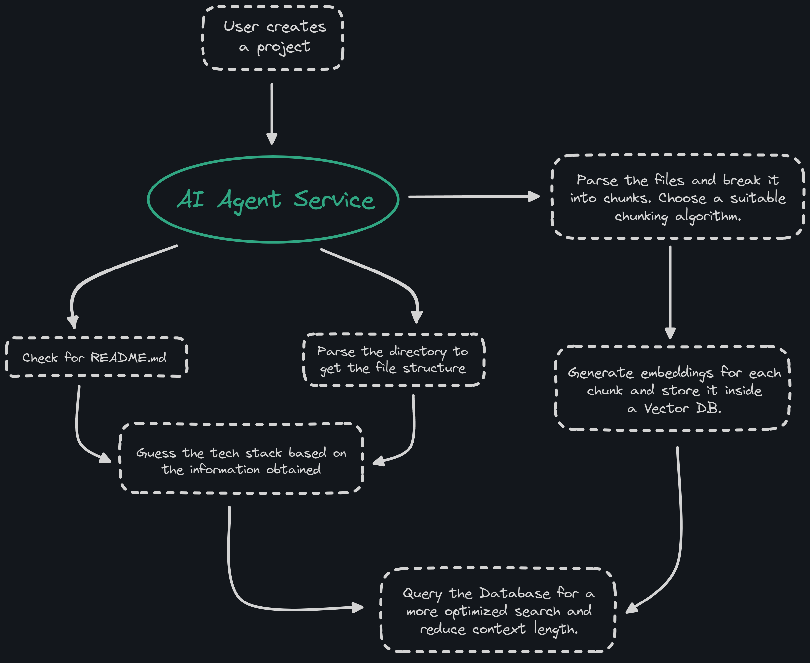

# Intelligent Code Base Embedding and Query System

## Overview

This project implements an AI-driven system that generates and stores embeddings for entire codebases from GitHub repositories. It uses vector databases to allow developers to efficiently search and understand large codebases, leveraging embeddings for precise code retrieval and analysis.



## Job to be Done

**When** developers and development teams need an efficient way to search, understand, and utilize large codebases,

**We want to** create a system that uses vector databases (for example ChromaDB or Postgres/pgvector) to generate and store embeddings of the entire codebase from a GitHub repository.

**So that** developers can quickly find and understand code snippets, dependencies, and the overall structure, with potential for creating new features on top of this.

## Objectives

1. **Code Chunking:** Develop a strategy for breaking down large codebases into manageable chunks suitable for embedding.
2. **Embedding Generation:** Select an appropriate embedding model that is fast, reliable, and has long-term support.
3. **Vector Storage:** Integrate with a vector database to store the generated embeddings efficiently.
4. **Search and Query:** Implement a powerful search and query system that leverages the embeddings for quick and precise code retrieval.
5. **Best Practices and Strategies:** Research and document the best practices for chunking and embedding codebases to ensure accuracy and efficiency.
6. **API Exposure:** Expose an API for performing search, query, and other relevant actions to facilitate integration with other systems and tools.

## Features

- Code Chunking: Breaks down large codebases into manageable chunks suitable for embedding.
- Embedding Generation: Uses Azure OpenAI's embedding model for fast and reliable embedding creation.
- Vector Storage: Integrates with ChromaDB for efficient storage of generated embeddings.
- Search and Query: Implements a powerful search and query system leveraging embeddings for quick and precise code retrieval.
- GitHub Integration: Fetches repository content and structure directly from GitHub.
- Interactive UI: Provides a Streamlit-based user interface for easy interaction with the system.

## Functional Requirements

### 1. Code Chunking
- Develop a strategy for breaking down code into chunks (e.g., by methods/functions or fixed line numbers).
- Ensure chunks are semantically meaningful to preserve context.
- Implement chunking using Python to preprocess the codebase.
- Store metadata about each chunk, including file path, chunk number, and surrounding context.

### 2. Embedding Generation
- Use Azure OpenAI's embedding model for efficiency and long-term support.
- Develop a pipeline to generate embeddings for each chunk of code.
- Ensure embeddings are generated quickly to handle large codebases.

### 3. Vector Storage
- Use ChromaDB to store the generated embeddings.
- Design a schema that stores embeddings along with their metadata for efficient retrieval.
- Optimize storage for speed and scalability.

### 4. Search and Query
- Develop a search system that queries the vector database using embedding vectors.
- Implement a Streamlit-based frontend for developers to input search queries and view results.
- Optimize search queries for speed and accuracy.

### 5. Best Practices and Strategies
- Document best practices for chunking code and embedding generation.
- Provide guidelines on optimizing vector storage and query strategies.

### 6. API Exposure (Future Enhancement)
- Develop a comprehensive RESTful API to expose functionalities for search, query, and other relevant actions.
- Ensure API security, documentation, and scalability.

## Developing in Daytona

To run this project in Daytona, you'll need to have Daytona installed. Follow these steps to set up the project:

1. **Install Daytona**:
    ```bash
    (curl -L https://download.daytona.io/daytona/install.sh | sudo bash) && daytona server stop && daytona server -y && daytona
    ```

2. **Create new project and run IDE**:
    ```bash
    daytona create https://github.com/daytonaio-experiments/exp-202408-emerald --code
    ```

## Installation (if not using Daytona)

1. Clone the repository:
   ```
   git clone https://github.com/daytonaio-experiments/exp-202408-emerald
   cd exp-202408-emerald
   ```

2. Install the required dependencies:
   ```
   pip install -r requirements.txt
   ```

## Set up

1. Set up environment variables:
   Create a `.env` file in the project root and add the following:
   ```
   AZURE_API_VERSION=your_azure_api_version
   AZURE_ENDPOINT=your_azure_endpoint
   AZURE_OPENAI_API_KEY=your_azure_openai_api_key
   GITHUB_TOKEN=your_github_personal_access_token
   ```

## Usage

Run the Streamlit app:
```
streamlit run app.py
```

Follow the instructions in the UI to:
1. Enter a GitHub repository URL and project name.
2. Preprocess the codebase to extract code chunks and create embeddings.
3. Query the codebase using natural language.
4. Explore code chunks and main files.
5. View repository statistics.

## Project Structure

```
exp-202408-emerald
├── LICENSE
├── requirements.txt
├── README.md
├── flowchart.png
└── app.py
```

## Dependencies

- openai
- scipy
- qdrant-client
- streamlit
- python-dotenv
- requests
- chromadb
- tqdm
- backoff
- plotly

## Non-Functional Requirements

- Scalability: Handle large codebases with millions of lines of code.
- Performance: Optimize for speed in chunking, embedding generation, storage, and search queries.
- Usability: Provide a user-friendly interface for searching and querying code.
- Reliability: Ensure high accuracy in chunking, embedding generation, and search results.
- Maintainability: Implement modular and maintainable code for future enhancements.

## Future Enhancements

- Interactive Search Customization: Allow users to refine and customize their search queries.
- Continuous Learning: Track and log search interactions to improve accuracy and efficiency over time.
- Multimodal Embeddings: Explore combining code with other relevant data for enhanced search capabilities.
- API Development: Expose a RESTful API for integration with other systems and tools.

## License

This project is licensed under the Apache License 2.0. See the [LICENSE](LICENSE) file for details.

## Contributing

Contributions are welcome! Please feel free to submit a Pull Request.

## Acknowledgements

- Azure OpenAI for providing the embedding model
- ChromaDB for vector storage
- Streamlit for the interactive UI
